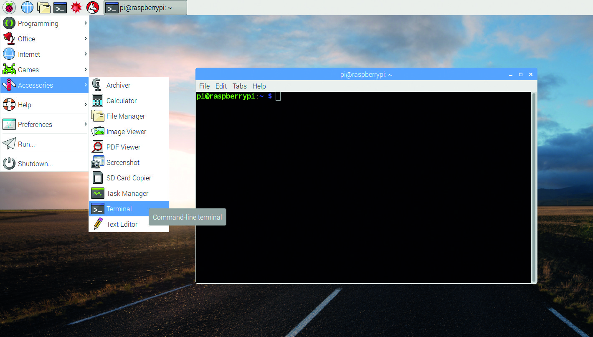

# PiBot Project
The project PiBot was originally developed to learn the use of the PiBot library for python. 
The PiBot library was originally taken from [*here*](https://gitlab.hrz.tu-chemnitz.de/ketf--tu-chemnitz.de/hufa-pibot.git). This will be used to control a RasperyPy-Robot.
In this repository, the code script to drive the a RasperiPy-Robot through the following parkour using the robot library PiBot is included:

For this porpuse, three ultrasonic sensors were used, which were attached and installed to the RasperyPi-Robot. They return the distance to the obstacles in the environment in three different direction: Left, Middel and Right. The sensors were calibrated and carried out with help of the Pibo library. 

# Installation
PiBot and the corresponding operating system (OS) on a micro sd card are needed.
The OS is already prepared for use.

# How to use
To use the PiBot: 
##### 1. Connect a mouse, keyboard and screen
to the corresponding ports of the Raspberry Pi,
##### 2. Connect the powerbank and the 9V battery 
with their corresponding plugs.
Alternatively, you can also connect the USB cable to a normal 5V USB power supply (like a smartphone charger). The minimum power supply of the charger should be 1.8A.
##### 3. Turn the PiBot on
by setting the left switch to "AKKU" and the right switch to "Motor+Not".
##### 4. Wait
until the operating system has booted successfully.

# How to update
To get the latest version of the project files, you have to perform the following steps:

##### 1. Connect to the internet.
First, make sure, that local computer is connected to the internet.
it could be connected to the WLAN via the network button in the upper right corner.


##### 2. Open a terminal.
That oculd be done by clicking on the terminal icon on the upper taskbar or in the menu.



##### 3. Navigate to the hufa-pibot directory.
it could be done by typing 
```bash
cd ~/hufa-pibot
```

##### 4. Update the repository.
By typing
```bash
git pull
```
the latest version of the files will be downloaded from the server.


# Usage of the library
To use the funcionalities of the PiBot, the library files should be included to your project.
This is already done for all provided files. 
Nevertheless here is the example code how to do this:

```python
from pibot import *
display.sample_function("test")
```

### Further information can be found in [01-Python_Tutorial.md](01-Python_Tutorial.md) and [02-PiBot_Programming_Guide.md](02-PiBot_Programming_Guide.md).
